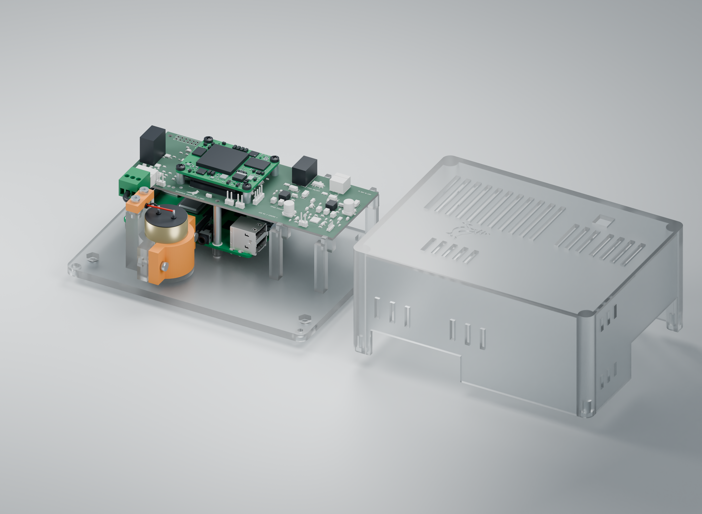
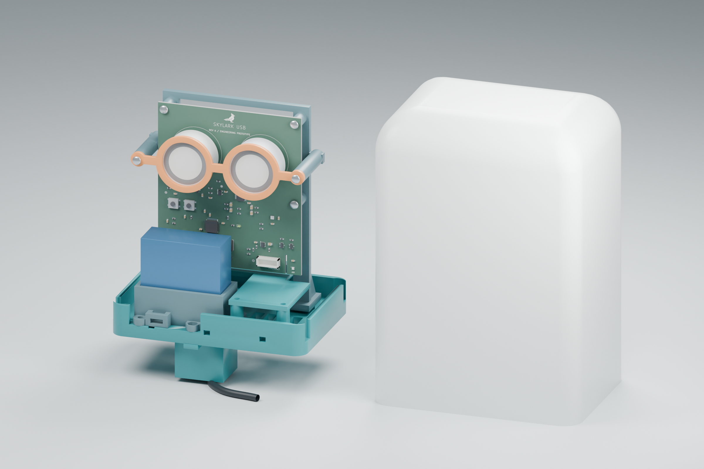
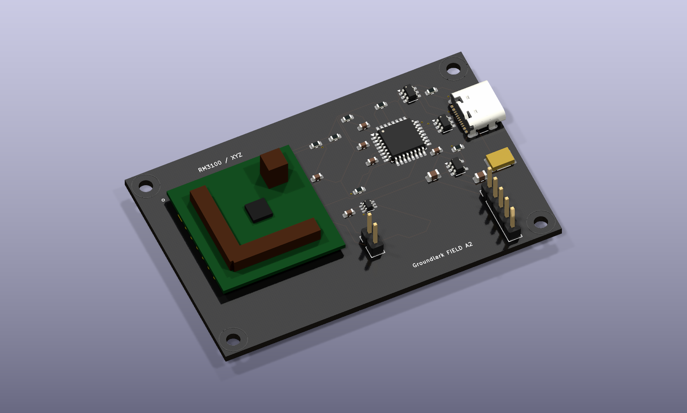

# Groundlark — open hardware for seismic and environmental monitoring

Groundlark is a family of hardware boards and companion software for seismic
and environmental monitoring. Each board has its own hardware directory, with
shared component libraries, interfaces and validation tools.

The family has **three products and four hardware designs**: Groundlark has
separate FPGA and Coldfoot HAT variants; Skylark and Burrowlark are USB sensor
heads. All share the sensor contracts, simulation tools and local workbench.

## Groundlark



**Seismic monitoring on a Raspberry Pi.** The active
[Groundlark FPGA HAT](hw/groundlark-fpga-hat/README.md), model **DAQHAT-01**, is an
85 × 56 mm, six-layer FR-4 board with three XYZ LSM6DSO IMUs and an ADS122C04
input for an external Racotech geophone. The stack is **Pi → HAT → Trenz
Artix-7 200T FPGA**. Pi acquisition works independently of a configured FPGA.

The [internal FPGA link](docs/fpga-host-link.md) provides six QSPI wires, UART,
reset and switched Pi-driven JTAG. An SPI echo bitstream is implemented;
accelerated sensor processing and native quad transfers remain future work.
The FPGA needs a separate regulated 3.3 V-class supply within the
[hardware guide's](docs/trenz-hat.md) voltage and power limits.

The [Groundlark Coldfoot HAT](hw/groundlark-coldfoot-hat/README.md) is a separate,
retained A2 ASIC design. Coldfoot integration is deferred while development
focuses on sensor acquisition with the Pi/DAQHAT-01/Trenz stack.

**Status:** active prototype. Physical power, fit, timing, noise and thermal
qualification remain pending. See the [stack assembly guide](docs/stack-assembly.md),
[JLCPCB instructions](docs/jlcpcb-assembly.md) and [bench procedure](docs/bench-procedure.md).
The JLCPCB package targets one assembled HAT; sourcing, placement and J1 fit
checks remain open. Fabrication packages stay local in ignored `hw/releases/`.

*R2 [prototype enclosure](hw/mechanical/daqhat-01-case/README.md), current
HAT CAD, vendor Trenz components and a detailed
[Pi 4B model](hw/shared/models/raspberrypi4/README.md) by integrated-circuit / FreeCAD
community (CC BY 3.0). Clear PETG appearance, risers, geophone and wiring are approximate.
Physical fit remains unqualified. [Render provenance](docs/images/groundlark-enclosure.json).*

## Skylark



**Outdoor air-quality monitoring over USB.** [Skylark USB](hw/skylark-usb/README.md)
combines a vertical **90 × 100 mm PCB** with a removable sensor tray and a
**130 × 94 × 185 mm bell enclosure**.

- **Particles:** Plantower PMS5003, with separate downward-facing inlet and exhaust paths.
- **Gases:** socketed SGX-7SO2-AQ-20 sulfur dioxide and SGX-7H2S-AQ-25 hydrogen sulfide cells.
- **Weather:** SHT40 temperature/humidity and BMP390 barometric pressure.
- **Connection:** USB-C power and data through an STM32F072 microcontroller.
- **Housing:** printable bell, rear M4 keyhole mounts and a removable tray with
  separate PMS cradle and splash cover. Bottom ventilation is sheltered by a 25 mm skirt.

[Prototype firmware](sw/skylark/README.md) implements sensor acquisition and
USB streaming. The shared workbench includes Skylark simulation, recording/replay,
board-specific tests and an interactive 3D PCB. Gas data retains separate raw
working and auxiliary electrode counts; concentrations require calibration.

**Status:** Rev A PCB, Rev G enclosure and prototype firmware are implemented.
Physical fit, USB power behavior, analog performance, gas response and weather
resistance still require qualification. The ventilated enclosure has no assigned
IP rating. Follow the [PCB guide](hw/skylark-usb/README.md) and
[enclosure assembly instructions](hw/skylark-usb/mechanical/bell/README.md).

*Render: native PCB artwork and authored component models in the CAD-derived
tray, with the bell set beside it. Component bodies are dimension envelopes;
fasteners and cable dressing are illustrative. [Render provenance](docs/images/skylark-assembly.json).*

## Burrowlark



**Remote magnetic sensing over USB.**
[Burrowlark USB](hw/burrowlark-usb/README.md), model **DAQUSB-01**, carries an
RM3100 magnetometer. It connects to the Pi through USB-C for power and data.
The DLVR infrasound sensor is fitted on Groundlark DAQHAT-01.

**Status:** hardware design and workbench simulation are present; MCU firmware
and physical qualification remain pending. See the
[USB sensor-head guide](docs/usb-sensor-head.md) for interfaces and assembly details.

*Render: native 70 × 45 mm PCB with the RM3100 module; the former infrasound
footprint and bypass capacitor are removed. Module and fuse bodies are simplified
dimensional envelopes. [Render provenance](hw/burrowlark-usb/boards/groundlark-field-head/render-provenance.json).*

## Sensor workbench

The dark-mode Python UI lets you switch between Groundlark, Skylark and
Burrowlark, with interactive 3D views, raw-data charts, stimulus/fault controls,
board-specific tests and recording/replay.
No hardware or Docker is required. Follow the
[beginner walkthrough](docs/sensor-workbench.md) to create your first signal.

```powershell
# Windows: set up once, then launch
./setup-ui.ps1 -Check
./ui.ps1
```

On Linux/macOS, use `sh ./setup-ui.sh --check`, then `sh ./ui.sh`.
Open **http://127.0.0.1:8080**. Tools and dependencies stay in ignored `.local/`.


This is an actual browser screenshot with simulated data. Select the geophone
can or its HAT input to highlight both and inspect the same ADC stream.
Use the **Board** selector for the FPGA HAT, Burrowlark or Skylark.
**Test selected board** runs the selected board’s checks; the HAT test runs eight simulated seconds through production Pi drivers
on modeled buses, with signal checks and downloadable recordings/results.
The UI simulates and replays; physical acquisition uses the [Pi software](docs/sensor-software.md).

## Project files and tests

| Directory | Contents |
| --- | --- |
| [hw/](hw/README.md) | Four product directories, shared component resources, hardware checks and SPICE. |
| [sw/](sw/README.md) | Pi acquisition, contracts, simulator, FPGA and remote firmware interfaces. |
| [docs/](docs/README.md) | Setup, hardware specifications, assembly, interfaces and testing instructions. |
| [environment/](docs/portable-lab.md) | Pinned Docker test environment and bounded cleanup tooling. |

For the full test environment, run `./lab.ps1 build` once, then `./lab.ps1 test`.
Use `./lab.ps1 test -Profile software` for sensor contracts, acquisition,
recording/replay and recovery. See the [portable lab guide](docs/portable-lab.md)
for Linux commands, test scope, five-run retention and cleanup.

Hardware sources: [DAQHAT-01 circuit](hw/groundlark-fpga-hat/elec/hat_trenz.ato),
[KiCad PCB](hw/groundlark-fpga-hat/boards/groundlark-daqhat-01/groundlark-daqhat-01.kicad_pcb),
[A2 HAT](hw/groundlark-coldfoot-hat/boards/groundlark-hat/groundlark-hat.kicad_pcb),
[Burrowlark DAQUSB-01](hw/burrowlark-usb/boards/groundlark-field-head/groundlark-field-head.kicad_pcb), and
[Skylark USB](hw/skylark-usb/boards/skylark-usb/skylark-usb.kicad_pcb).
See [build instructions](docs/build.md) and [source references](docs/sources.md).
