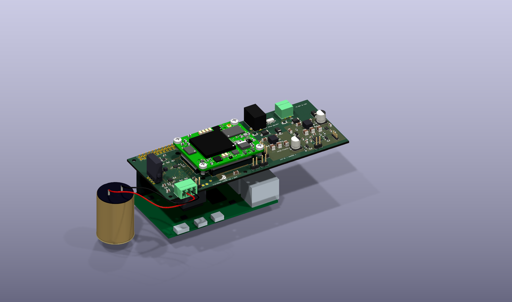

# Groundlark — open hardware for seismic and environmental monitoring

Groundlark is a family of hardware boards and companion software for seismic
and environmental monitoring. Each board has its own hardware directory, with
shared component libraries, interfaces and validation tools.

| Board | Purpose | Status |
| --- | --- | --- |
| [Groundlark FPGA HAT](hw/groundlark-fpga-hat/README.md) — DAQHAT-01 | Three XYZ IMUs, geophone input and Trenz FPGA interface. | Active prototype; Pi acquisition and SPI echo implemented; physical qualification pending. |
| [Groundlark Coldfoot HAT](hw/groundlark-coldfoot-hat/README.md) | Separate A2 ASIC HAT design. | Retained; Coldfoot integration deferred. |
| [Burrowlark USB](hw/burrowlark-usb/README.md) — DAQUSB-01 | USB magnetometer and optional infrasound sensor head. | Hardware design present; MCU firmware and physical qualification pending. |
| [Skylark USB](hw/skylark-usb/README.md) | Outdoor air-quality accessory for particles, SO₂, H₂S and basic environmental measurements. | Planned; no circuit, PCB or firmware yet. USB only; camera omitted. |

Current development focuses on sensor acquisition with the Raspberry Pi,
DAQHAT-01 and Trenz Artix-7 200T stack, plus an external passive geophone.



The image uses current HAT CAD and the vendor Trenz model. The Pi, baseline
socket and geophone are conceptual geometry; lead routing is illustrative.
The J1 procurement substitute needs a physical stack-height check.

## Hardware

The [DAQHAT-01](docs/trenz-hat.md) is an 85 × 56 mm, six-layer FR-4 carrier with
three XYZ LSM6DSO IMUs and one ADS122C04 input for an external Racotech geophone.
The stack is **Pi → HAT → Trenz FPGA**. It requires a separate regulated
3.3 V-class FPGA supply; follow the guide's voltage and power limits.

The [internal FPGA link](docs/fpga-host-link.md) reserves six QSPI wires and
supports UART, reset and switched Pi-driven JTAG without external ribbon cables.
Pi 4 initially uses SPI6; native quad transfers require a different host solution.
An SPI echo bitstream is implemented; accelerated sensor processing remains future work.

The [Burrowlark (DAQUSB-01) USB-C sensor head](docs/usb-sensor-head.md) carries
an RM3100 magnetometer and optional DLVR infrasound sensor. It connects to the Pi for power and data;
its MCU firmware is still pending. These sensors are separate from the HAT.
The [A2 ASIC HAT](docs/design-a0.md) and [Coldfoot integration](docs/coldfoot-integration.md)
are retained as a separate design; current hardware work focuses on the FPGA stack.

Use the [stack assembly guide](docs/stack-assembly.md) and
[JLCPCB instructions](docs/jlcpcb-assembly.md) for mechanical and manufacturing details.
The JLCPCB package targets **one assembled HAT**. Upload the corrected BOM and
CPL together. Supplier quantity, sourcing, placement and J1 fit checks remain open.
Fabrication packages stay local under ignored `hw/releases/`.

Physical power, fit, timing, noise and thermal qualification remain pending.
The [bench procedure](docs/bench-procedure.md) describes the required measurements.

## Sensor workbench

The dark-mode Python UI includes a selectable 3D HAT and geophone, six virtual
sensor streams, raw-data charts, stimulus/fault controls and recording/replay.
No hardware or Docker is required. Follow the
[beginner walkthrough](docs/sensor-workbench.md) to create your first signal.

```powershell
# Windows: set up once, then launch
./setup-ui.ps1 -Check
./ui.ps1
```

On Linux/macOS, use `sh ./setup-ui.sh --check`, then `sh ./ui.sh`.
Open **http://127.0.0.1:8080**. Tools and dependencies stay in ignored `.local/`.


This is an actual browser screenshot with simulated data. Select the geophone
can or its HAT input to highlight both and inspect the same ADC stream.
**Test HAT signals** runs eight simulated seconds through production Pi drivers
on modeled buses, with signal checks and downloadable recordings/results.
The UI simulates and replays; physical acquisition uses the [Pi software](docs/sensor-software.md).

## Project files and tests

| Directory | Contents |
| --- | --- |
| [hw/](hw/README.md) | Four product directories, shared component resources, hardware checks and SPICE. |
| [sw/](sw/README.md) | Pi acquisition, contracts, simulator, FPGA and remote firmware interfaces. |
| [docs/](docs/README.md) | Setup, hardware specifications, assembly, interfaces and testing instructions. |
| [environment/](docs/portable-lab.md) | Pinned Docker test environment and bounded cleanup tooling. |

For the full test environment, run `./lab.ps1 build` once, then `./lab.ps1 test`.
Use `./lab.ps1 test -Profile software` for sensor contracts, acquisition,
recording/replay and recovery. See the [portable lab guide](docs/portable-lab.md)
for Linux commands, test scope, five-run retention and cleanup.

Hardware sources: [DAQHAT-01 circuit](hw/groundlark-fpga-hat/elec/hat_trenz.ato),
[KiCad PCB](hw/groundlark-fpga-hat/boards/groundlark-daqhat-01/groundlark-daqhat-01.kicad_pcb),
[A2 HAT](hw/groundlark-coldfoot-hat/boards/groundlark-hat/groundlark-hat.kicad_pcb), and
[Burrowlark DAQUSB-01](hw/burrowlark-usb/boards/groundlark-field-head/groundlark-field-head.kicad_pcb).
See [build instructions](docs/build.md) and [source references](docs/sources.md).
