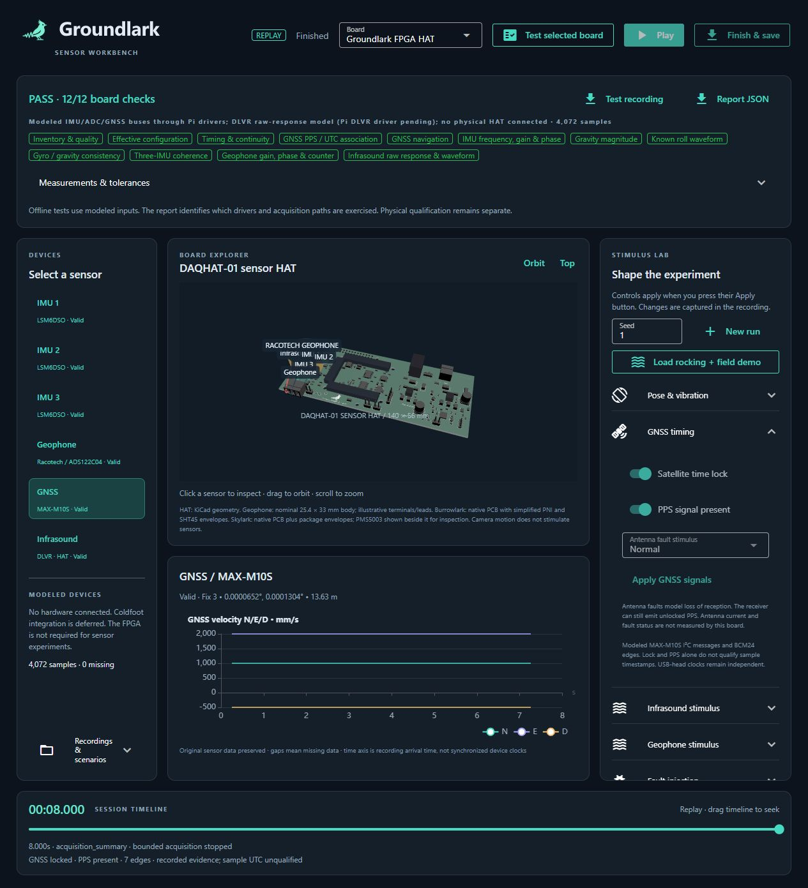
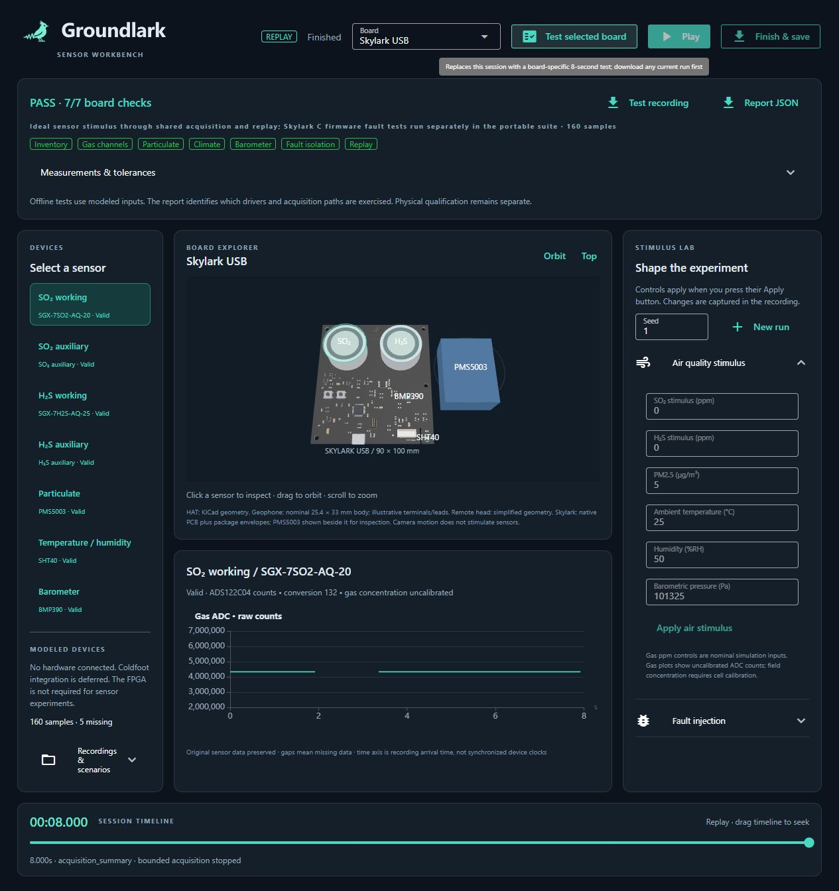

# Run your first Groundlark sensor experiment

For continuous station capture, open **Station** from this same app. The station
page connects to a separate local acquisition service, so closing it leaves
capture running. It shows source mode, raw samples, missing/known/unknown loss,
storage and raw-count RSAM summaries. Pause/resume controls apply per source.
Completed SSREC downloads replay in this workbench. Configuration edits are
validated and restart the service; see the [station setup](../sw/pi/deploy/README.md).

The sensor workbench is a local browser app for trying virtual sensors and
replaying recordings. Choose a board, click a sensor in its 3D view, change an input, and watch
its signal. **No Raspberry Pi or sensor hardware is required.**
The header uses the same lark-and-waveform wordmark as the project README.
The Groundlark view includes the revised C43 placement and selected 8.5 mm Pi
socket envelope. The display shows the HAT; the two external GPIO risers are
covered by the [stack assembly instructions](stack-assembly.md).

You need internet access for setup, a modern browser with WebGL, and Windows
PowerShell or a Linux/macOS terminal. The scripts install the needed Python
tools locally. Docker, KiCad, Node.js and an FPGA are not prerequisites.



## 1. Get the project

If you already have the project folder, use it. Otherwise visit the
[Groundlark repository](https://github.com/crockpotveggies/groundlark), choose
**Code → Download ZIP**, and extract it to a folder you can write to.
Git users can instead run `git clone https://github.com/crockpotveggies/groundlark.git`.

Open a terminal in that folder. You should see `README.md`, `setup-ui.ps1` and
`setup-ui.sh`. On Windows, right-click the folder and choose **Open in Terminal**,
using a PowerShell tab. On macOS/Linux, use `cd` followed by your folder's path;
quote paths that contain spaces.

## 2. Set up once, then start

**Windows — PowerShell:**

```powershell
./setup-ui.ps1 -Check
./ui.ps1
```

**Linux/macOS — Terminal:**

```sh
sh ./setup-ui.sh --check
sh ./ui.sh
```

Setup downloads a pinned uv tool from its official source and installs the
locked Python dependencies. The check option starts a temporary server,
checks the page and assets, and tests the geophone scene. Wait for the checks
to pass; the first download may take a few minutes. Rerunning setup is safe.

Once the launch command reports the server is ready, open
**[http://127.0.0.1:8080](http://127.0.0.1:8080)**. Keep the terminal open while
using the app. **Ctrl+C** in that terminal stops it.
Next time, just run `./ui.ps1` or `sh ./ui.sh` again.

If PowerShell blocks scripts, follow your computer's approved process for
running local development scripts. On a managed computer, ask your administrator.
The project does not need administrator privileges or a permanent policy change.

## 3. Make a geophone signal

1. Click **Geophone** in the device list or the gold can in the 3D view. The can
   and its HAT input highlight together: they represent one signal.
2. Expand **Geophone stimulus** on the right (below the charts on a narrow screen).
3. Set **Vertical velocity amplitude** to **100** µm/s and **Frequency** to **2** Hz.
4. Press **Apply geophone tone**, then **Start** in the top bar.
5. After a few seconds, press **Pause**. Look for a repeating wave in
   **Geophone ADC · raw counts** and a **Valid** status.

Changing a box alone does not change the experiment: press its **Apply** button.
The geophone has one vertical channel. The chart shows ADC counts, not velocity
units. Zero motion produces a flat ideal trace. The model includes nominal
geophone response, but not real noise or settling. The chart retains recent
points; the recording contains the whole run.

## 4. Try the other sensors

Choose **HAT + Burrowlark** in the **Board** menu, then click
**Load rocking + field demo** and **Start** to explore IMU and remote-head
signals. This replaces the current run, so save first if needed.

| Control | What to look for |
| --- | --- |
| **Pose & vibration** | Select an IMU; tilt moves gravity between XYZ axes, and vibration adds an oscillation. A stationary IMU still measures gravity. |
| **Magnetic field / Infrasound stimulus** | Select Magnetometer for Burrowlark (DAQUSB-01), or Infrasound for the fitted pressure sensor on the HAT. |
| **Fault injection** | Apply a sensor fault and inspect status, events and missing-data gaps. Start a new run to return to a clean baseline. |
| **Top / Orbit**, drag, scroll | Change the camera only. These gestures do not stimulate sensors or change recorded samples. |

Choose **Skylark USB** to inspect its PCB and gas cells. **Air quality stimulus**
controls nominal SO₂/H₂S, PM2.5, temperature, humidity and pressure. Press
**Apply air stimulus**, then **Start**. Gas plots show independent raw working
and auxiliary counts; the ppm controls are ideal model inputs, not a calibration.
PM plots show the atmospheric PM1/PM2.5/PM10 fields. Climate/barometer displays
apply the manufacturer's conversion equations while retaining original bytes.
The PMS5003 is shown beside the PCB for inspection, not in its mounted bell pose.



Changing boards starts a new run, so save the current recording first. The menu
supports the FPGA HAT, Burrowlark, their combined simulation, and Skylark.
Coldfoot remains deferred. Choose an individual board to enable its test button.
Imported recordings select their board automatically.

The HAT has three IMUs and one geophone input. The optional remote head adds
magnetometer and pressure streams: six sensor streams altogether.

## 5. Save and replay

- **Finish & save** ends the capture and downloads a `.ssrec` recording to your
  browser's download location. It includes samples and applied input changes.
- Under **Recordings & scenarios**, upload that recording. Press **Play** or
  move the timeline slider to inspect it.
- In replay mode, stimulus controls are disabled because the samples already
  exist. Use **New run** to create a new experiment.
- **Export scenario** saves inputs as JSON. Import it with the same seed to
  repeat the experiment. See [advanced scenarios](stimulus-models.md).

**Save before refreshing, closing the tab or starting a new run.** Experiments
live in memory, independently in each tab. There is no automatic save database.
A capture stops at three simulated minutes or its 8 MiB limit.

## 6. Run a board check

Save your experiment, then press **Test selected board**. With **Groundlark FPGA HAT** selected, the app runs eight seconds
of modeled input through the production HAT drivers and opens the capture in
replay. Expect **nine passing checks** covering **3,264 samples** from the three
IMUs and geophone input. Expand the results for measurements and tolerances;
download the recording and JSON report from that panel.

With **Skylark USB** selected, expect seven checks: inventory, gas channels,
particulate, climate, pressure, isolated failure and replay. Burrowlark has five
checks. These two USB-board UI tests use ideal sensor stimuli through the shared
acquisition/controller; the portable software profile separately compiles and
runs Skylark's actual C drivers/encoder with injected register/UART faults and
builds the ARM firmware. The report states each test's scope.

The HAT check tests driver and recording behavior on modeled buses. It does not prove
physical power, fit, timing, noise, sensor accuracy or FPGA operation. The browser
currently simulates and replays; it does not connect to a real HAT. For real Pi
acquisition, use the [Linux software guide](sensor-software.md).

## Troubleshooting

| Symptom | What to do |
| --- | --- |
| Setup cannot download packages | Check your internet/proxy settings and retry setup. Keep TLS verification enabled. |
| `uv` or Python is missing | Run setup; no separate Python install is needed. |
| Browser cannot connect | Keep the launcher terminal open, wait for the ready message, and check errors printed there. |
| Port 8080 is already in use | Run `./ui.ps1 -Port 8081` or `sh ./ui.sh --port 8081`, then open `http://127.0.0.1:8081`. |
| 3D area is blank | Enable WebGL/hardware acceleration or try another current browser. Run `./ui.ps1 -Check` / `sh ./ui.sh --check` to check asset delivery separately. |
| Flat or empty chart | Select the intended sensor, press **Apply**, then **Start**. Check status and faults. Paused or unexcited sensors may correctly stay flat. |
| Changes seem ineffective | Press **Apply**. Stimulus controls are unavailable during replay. Camera gestures never stimulate sensors. |
| Recording will not open | Keep the original file. The app rejects corrupt data; an incomplete recording may show a completion warning, while a corrupt one is rejected. |
| Board visualization is stale | Use matching code/CAD/assets from the same checkout. Contributors should follow [asset provenance](../sw/ui/assets/README.md). |

## Storage and cleanup

Setup stores its tools under ignored `.local/`: uv, Python when needed, virtual
environments and the package cache. It leaves your persistent PATH and circuit
design environment unchanged. Windows and Unix use separate environments.
Startup generates the schema in ignored `sw/build/ui-schema.binpb`.
Experiments create no run folders; browser downloads remain separate.

To reclaim only the package download cache, stop the app and run:

```powershell
# Windows
./.local/tools/uv-windows/uv.exe cache clean --cache-dir .local/uv-cache
```

```sh
# Linux/macOS
./.local/tools/uv-unix/uv cache clean --cache-dir .local/uv-cache
```

Dependencies may need downloading again afterward. Keep other `.local/` files:
they can include project tools and manually saved results.
After updating the repository, rerun setup with its check option.

## For contributors

See [sensor software](sensor-software.md) for data and timing semantics and
[UI source notes](../sw/ui/README.md) for checks and asset provenance.

The scene reads the FPGA HAT and Burrowlark placement files from their respective
product directories under `hw/`. Moving these files requires updating the scene's
paths and asset provenance together; see the [project map](project-layout.md).
The [portable lab](portable-lab.md) is the separate Docker-based full regression
environment; it is optional for using this UI.
Setup uses the official [uv installer options](https://docs.astral.sh/uv/reference/installer/)
with an unmanaged local install and the checked `sw/ui/uv.lock`.

Skylark display geometry includes the 4.88 mm socket standoff, guarded sensor
region and 1206 C0G feedback banks. Its asset manifest binds the
current PCB, package models and selection targets; it does not establish
physical fit or measured sensor noise.

The current Skylark profile retains gas raw samples at a nominal 31.25 Hz per
electrode and labels the fitted barometer BMP388. Legacy 240 ms gas recordings
remain readable with their original cadence. See [response limits](sensor-response.md)
for filtering, noise and timing interpretation.

The current HAT view includes the fitted DLVR infrasound sensor (sensor ID 8).
Burrowlark contains only the magnetometer. Workbench pressure remains simulated;
adding the sensor to the PCB does not implement Pi live pressure acquisition.

The DAQHAT-01 scene includes the 140 × 56 mm carrier, separate FPGA power
section, barrel-jack and converter envelopes. Scene labels and sensor targets
use the current placement coordinates. The rendered power switch is a physical
board feature; simulation controls do not operate it.

## Burrowlark temperature and humidity

Select **Burrowlark USB**, then **Enclosure climate** (SHT45, sensor 17), or click
its selection ring beside U6 on the native PCB model. Expand **Enclosure climate**
in the stimulus panel, set temperature and relative humidity, and apply. Run the
simulation to see both signals update at 1 Hz. These controls model enclosure air.

**Test selected board** runs magnetic and climate steps, independently injects
timeout faults, checks missing readings and recovery, then opens the bounded
recording for replay. The report checks that the unaffected sensor stays valid.
The replay slider preserves both raw CRC-protected climate words. Camera movement
only changes the view. The displayed PNI and SHT45 bodies are dimensional envelopes;
this test does not qualify physical USB, sensor accuracy or enclosure response.

## GNSS timing on Groundlark

Select Groundlark, start a simulation, and select **GNSS / MAX-M10S**. The
GNSS timing panel controls satellite time lock and the separate PPS signal.
Apply the controls, then watch the timeline's lock state, PPS presence and edge
count. Navigation starts after receiver configuration; startup is not a zero fix.
Disable lock while leaving PPS enabled to model an unlocked receiver emitting
pulses; disable PPS alone to model a broken timing wire. Other sensors continue.
Choose **Disconnected** or **Shorted** in **Antenna fault stimulus** and apply
the controls to remove modeled reception while retaining receiver I2C access.
Choose **Normal** to restore reception. These are conservative signal scenarios;
they do not model reacquisition delay or short-circuit transients. The board has
no antenna-current measurement or connected U141 FAULT output, so the selected
fault is a simulation input, not detected hardware status. Recorded controls
preserve the fault for replay, and unlocked timing cannot supply a UTC reference.

**Test selected board** now exercises the production M10 I2C configuration and
readback driver, TIM-TP/NAV-TIMEUTC parsing, modeled BCM24 PPS and navigation
alongside the IMUs/geophone and the DLVR raw-response model. Its 12 checks cover
4,072 samples from all six HAT sensors, including infrasound waveform, status
and temperature bytes. The Pi DLVR hardware driver remains pending. Download
its report and recording. Finish & save
also retains timing events, controls and faults, and replay restores their state.
The test uses an explicitly synthetic UTC epoch and ideal edges. It does not
qualify physical sample times. Offline correlation uses the same bounded
[UTC association rules](utc-timing.md); USB-head clocks remain independent.
