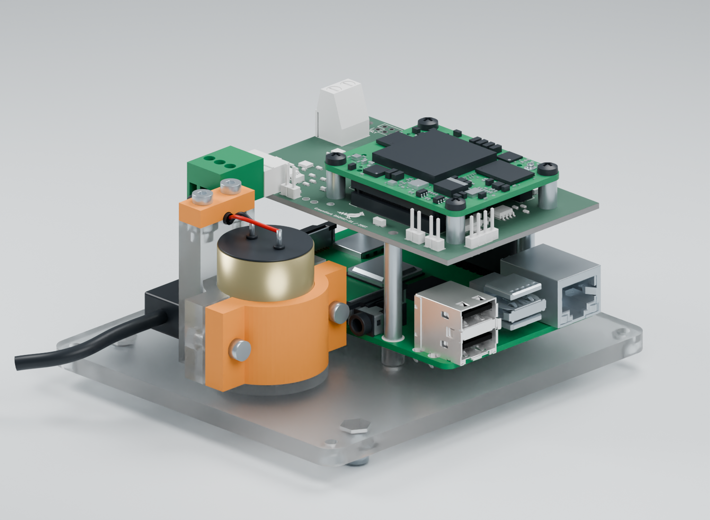

# DAQHAT-01 prototype enclosure

The vented indoor enclosure has a 104 × 118 × 75 mm body, 3 mm walls and roof,
and a 5 mm base. Its roof has a 20 mm tall bird recessed 0.6 mm, centered between
the two vent groups. The bird reuses the shared `Logo_Groundlark_7mm.kicad_mod`
favicon outline, including the eye, wing and leg openings.

Use **R2** files. R1 had mirrored physical geometry and is superseded; do not
print its base or cover. R2 converts native CAD Y-down coordinates to physical
Z-up once, and uses proper rotations for imported component models.

The Pi/HAT/Trenz stack is rotated 180° about its board center, putting J90 beside
the geophone bay. USB-C, HDMI and audio face that bay, opposite the GPIO header.
Connect them with the lid removed and dress leads through the bay-end opening.
USB-A ports use the adjacent side opening; microSD uses the opposite side.
In the assembly STEP frame these are -X for USB-A, +X for microSD, +Y for the
geophone bay and -Y for GPIO. This describes the physical geometry independently
of camera position. The PCB designs retain their native coordinates.

The USB-C insertion/cable corridor clears all printed parts and the geophone
for a 14 × 30 × 10 mm overmould and 4 mm cable. It has 1 mm clearance at the
narrow side of the exit. This envelope is a cable selection limit; actual plug
dimensions, bend radius and strain relief still need a physical fit check.

J90 is the horizontal Phoenix 1803280 header with a 1803581 cable plug.
The model reserves the full 16.1 mm plug length beyond the header mouth, without
crediting insertion overlap, plus a 12 mm withdrawal stroke. The raised clamp
beside this corridor holds the lead at connector height; release its cap before
unplugging. The Pi-to-HAT gap is 28.06 mm, matching the selected two-riser stack.
Actual mated dimensions, cable bend radius and clamp retention need a first fit.

Install `requirements.txt` in a separate CAD environment. From the repository root:

```sh
python hw/mechanical/daqhat-01-case/case.py
python hw/mechanical/daqhat-01-case/check.py
python hw/mechanical/daqhat-01-case/check_components.py
python -m unittest discover -s hw/mechanical/daqhat-01-case -p 'test_*.py'
```

STL, STEP, renders and fit evidence stay local in ignored
`hw/releases/groundlark-case-r2/`. Geometry used by the renderer is cached in
`.local/case/reference/`.

The checks cover independent Pi port/header landmarks, numbered mounting holes,
plug insertion/withdrawal, cover removal and watertight print meshes. Fault tests
reject mirrored GPIO/power geometry and obstructed openings. `check_components.py`
also checks all 89 detailed Pi solids against the four assembled printed parts.
Run `python hw/tools/pcb_handedness.py` with KiCad's Python environment to audit
both HATs' 40 numbered pads, Trenz contacts and supplier top/bottom placement.

With Blender 4.0.2 and the existing DAQHAT UI model, prepare the Trenz reference
from its vendor STEP and render with:

```sh
python hw/mechanical/daqhat-01-case/prepare_preview.py
python hw/mechanical/daqhat-01-case/prepare_components.py
blender --background --python hw/mechanical/daqhat-01-case/render.py
```

Use `-- --view assembly-open --material clear-petg` for an approximate clear PETG
material view. The renderer supports an `assembly-top` view for inspecting the
rotated stack. Material previews do not predict the transparency of a printed part.

The README image uses native populated HAT CAD, manufacturer Trenz components
and a [detailed Pi 4B model](../../shared/models/raspberrypi4/README.md), including
connector shells, contacts and IC bodies. Riser contact cavities and plug details
are authored reference geometry. Optional heatsinks are omitted from this view.
To reproduce it:

```sh
blender --background --python hw/mechanical/daqhat-01-case/render.py -- \
  --view assembly-open --material clear-petg --quality high --device CUDA --skip-glb
```

Use `--device CPU` when CUDA is unavailable. The high-quality output is
`preview/assembly-open-clear-petg-4k.png`, with a JSON sidecar recording input
hashes, camera, material and render settings. Copy both files to
`docs/images/groundlark-enclosure.png` and `.json` when updating the README.
Plug screw wells, wire entries and fastener recesses are illustrative render
details inside the reference envelopes; the fit checks use the conservative
solid envelopes. Planar enclosure faces retain flat normals.

Use `--view assembly-ports` for the component detail below. The Pi community CAD
retains its modeled 1.8 mm board thickness, seated on the supports; native fit
envelopes use the nominal 1.6 mm board. It is not certified mating CAD.



The renderer preserves planar faces to avoid wavy shading. Checks establish CAD
clearances and mesh validity; first-print fit, thermal behavior and noise remain
unqualified.
