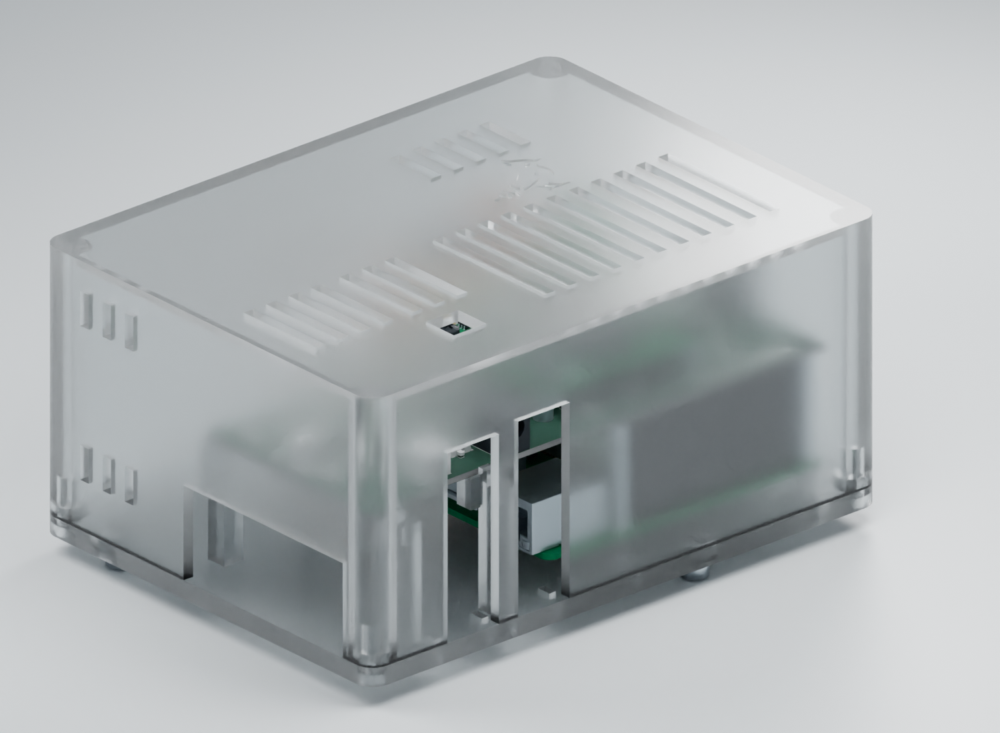

# DAQHAT-01 prototype enclosure

The vented indoor enclosure has a 159 × 118 × 75 mm body, 3 mm walls and roof,
and a 5 mm base. Its roof has a 20 mm tall bird recessed 0.6 mm, centered between
the two vent groups. The bird reuses the shared `Logo_Groundlark_7mm.kicad_mod`
favicon outline, including the eye, wing and leg openings.

Use **R3** files for the 140 × 56 mm HAT. R2 fits the previous 85 mm board;
R1 had mirrored physical geometry. Both are superseded for this assembly.
R3 retains the Pi-centered rotation and the original Pi/Trenz/geophone mounts.
Native CAD Y-down coordinates convert to physical Z-up once; imported component
models use proper rotations.

The Pi/HAT/Trenz stack is rotated 180° about the Pi board center, putting J90 beside
the geophone bay. USB-C, HDMI and audio face that bay, opposite the GPIO header.
Connect them with the lid removed and dress leads through the bay-end opening.
USB-A ports use the adjacent side opening; microSD uses the opposite side.
In the assembly STEP frame these are -X for USB-A, +X for microSD, +Y for the
geophone bay and -Y for GPIO. This describes the physical geometry independently
of camera position. The PCB designs retain their native coordinates.

## Independent FPGA power

The case extends 55 mm on physical -X for the FPGA and Pi power sections. J83 opens through
physical -Y, opposite the geophone bay (+Y). Use the specified 12 V,
center-positive 5.5/2.1 mm adapter. The rear opening reserves a **14 mm maximum
plug-overmould diameter**, with 1 mm lateral clearance. Its bottom-open slot
allows the cover to lift while the plug remains fitted. The jack mouth is
7.2 mm behind the inner wall; the plug overmould must enter the opening.
The 14 mm allowance checks the printed opening; a body this large must stop
at least 0.7 mm short of the jack face to clear the PCB edge. A body up to
12 mm diameter clears the PCB even if flush. Check the actual adapter body,
insertion travel and cable bend radius before use.

Four integral ledges bear on the HAT underside at native x=104–110 and 134–140 mm,
y=0–4 and 52–56 mm. Their columns sit beyond the Pi plug paths; the
ledges start 2 mm above the reserved Pi port clearance. End stops have 0.3 mm
nominal board-edge clearance to
limit insertion/withdrawal movement. Seat the board flat on all four saddles;
check print height against the measured riser stack before tightening mounts.
Do not force a warped board onto the supports. Retention and stiffness require
a first-print check. Base tie slots retain the power lead independently of the lid.

Operate SW80 with the lid removed, or through the 10 × 10 mm roof opening with
an insulated probe. Additional roof vents cover the converter section. Ventilation
has not been thermally qualified at the 3 A output allocation.

## Assembly and access

The USB-C insertion/cable corridor clears all printed parts and the geophone
for a 14 × 30 × 10 mm overmould and 4 mm cable. It has 1 mm clearance at the
narrow side of the exit. This envelope is a cable selection limit; actual plug
dimensions, bend radius and strain relief still need a physical fit check.

J90 is the horizontal Phoenix 1803280 header with a 1803581 cable plug.
The model reserves the full 16.1 mm plug length beyond the header mouth, without
crediting insertion overlap, plus a 12 mm withdrawal stroke. The raised clamp
beside this corridor holds the lead at connector height; release its cap before
unplugging. The Pi-to-HAT gap is 28.06 mm, matching the selected two-riser stack.
Actual mated dimensions, cable bend radius and clamp retention need a first fit.

Install `requirements.txt` in a separate CAD environment. From the repository root:

```sh
python hw/mechanical/daqhat-01-case/case.py
python hw/mechanical/daqhat-01-case/check.py
python hw/mechanical/daqhat-01-case/check_components.py
# In a Python environment with KiCad pcbnew installed:
python hw/mechanical/daqhat-01-case/check_pcb.py
python -m unittest discover -s hw/mechanical/daqhat-01-case -p 'test_*.py'
```

STL, STEP, renders and fit evidence stay local in ignored
`hw/releases/groundlark-case-r3/`. Geometry used by the renderer is cached in
`.local/case/reference/`.

The checks cover independent Pi port/header landmarks, numbered mounting holes,
plug insertion/withdrawal, cover removal and watertight print meshes. Fault tests
reject mirrored GPIO/power geometry, the old board outline, missing power-wing
supports and obstructed USB, barrel-plug and switch openings. `check_components.py`
also checks all 89 detailed Pi solids against the four assembled printed parts.
`check_pcb.py` checks the actual routed board underside and drilled-pad bounds
against both ledges with 0.5 mm clearance and rejects an injected pin collision.
Run `python hw/tools/pcb_handedness.py` with KiCad's Python environment to audit
both HATs' 40 numbered pads, Trenz contacts and supplier top/bottom placement.

With Blender 4.0.2 and the existing DAQHAT UI model, prepare the Trenz reference
from its vendor STEP and render with:

```sh
python hw/mechanical/daqhat-01-case/prepare_preview.py
python hw/mechanical/daqhat-01-case/prepare_components.py
blender --background --python hw/mechanical/daqhat-01-case/render.py
```

Use `-- --view assembly-open --material clear-petg` for an approximate clear PETG
material view. The renderer supports an `assembly-top` view for inspecting the
rotated stack. Material previews do not predict the transparency of a printed part.

The README image uses native populated HAT CAD, manufacturer Trenz components
and a [detailed Pi 4B model](../../shared/models/raspberrypi4/README.md), including
connector shells, contacts and IC bodies. Riser contact cavities and plug details
are authored reference geometry. Optional heatsinks are omitted from this view.
To reproduce it:

```sh
blender --background --python hw/mechanical/daqhat-01-case/render.py -- \
  --view assembly-open --material clear-petg --quality high --device CUDA --skip-glb
```

Use `--device CPU` when CUDA is unavailable. The high-quality output is
`preview/assembly-open-clear-petg-4k.png`, with a JSON sidecar recording input
hashes, camera, material and render settings. Copy both files to
`docs/images/groundlark-enclosure.png` and `.json` when updating the README.
Plug screw wells, wire entries and fastener recesses are illustrative render
details inside the reference envelopes; the fit checks use the conservative
solid envelopes. Planar enclosure faces retain flat normals.

Use `--view assembly-power` for the rear DC input and switch access.
Use `--view assembly-ports` for the component detail below. The Pi community CAD
retains its modeled 1.8 mm board thickness, seated on the supports; native fit
envelopes use the nominal 1.6 mm board. It is not certified mating CAD.


The renderer preserves planar faces to avoid wavy shading. Checks establish CAD
clearances and mesh validity; first-print fit, thermal behavior and noise remain
unqualified.



## Pi battery input

A separate rear slot admits J130's two-pole, 3.81 mm Phoenix battery plug.
The opening is 16 mm wide, with a conservative 13 mm plug-body envelope and
withdrawal path opposite the geophone. Its base tie slots retain the lead while
the cover lifts. Confirm the selected cable plug, wire bend and strain relief
physically. The two extra wing saddles support the enlarged board.

J130 is **8–18 V DC**, positive on pin 1. It is separate from the 12 V FPGA
barrel input. The HAT now powers the Pi; leave the Pi USB-C power input unused
while J130 is connected. Access JP130 and J131 with the cover removed.

## GNSS antenna access

The GNSS revision adds a bottom-open slot on physical **+X**, nearest J140.
The SMA axis is at Y=-40.2 mm and Z=47.61 mm in the assembly frame. Its mouth
is X=92.5 mm, recessed 2.5 mm from the outer wall. A male SMA coupling nut up
to 10 mm diameter can enter the slot and the lid can lift while it remains fitted.
The connector body is 9.5 mm high; its axis is 6.35 mm above the HAT. Verify the
actual plug, cable bend radius and strain relief before field use. The MAX-M10S
is underneath the HAT; overall board and enclosure dimensions remain unchanged.
The native board, conservative SMA body and plug withdrawal envelope are checked
separately. This vented enclosure has no assigned ingress rating.
