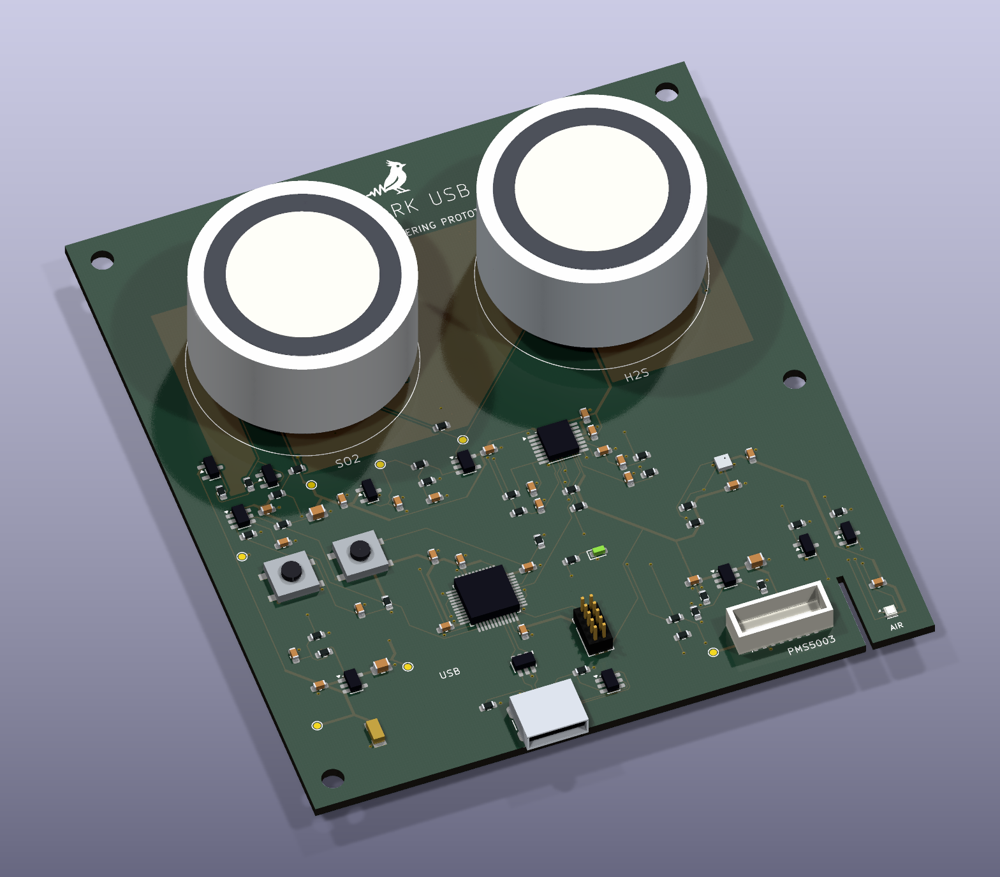

# Skylark USB — Rev A

Skylark is the Groundlark project's outdoor air-quality accessory. Its **90 × 100 mm,
four-layer PCB** mounts vertically inside a ventilated, downward-open hood. Two
removable gas cells face the sheltered air space. A separate PMS5003 sits beside
the board, with its sampling face toward the bottom grille.

The front silkscreen carries the 7 mm Groundlark favicon above the Skylark title.

The atopile circuit, routed KiCad board, review schematic and BOM are implemented.
This is an **engineering prototype**, with [STM32 firmware](../../sw/skylark/README.md)
and shared simulation/tests implemented. Calibration and physical
qualification remain pending; it is not a fabrication release or a validated
volcanic warning instrument. No camera, Pi HAT or separate sensor daughterboard is included.

## Hardware

| Function | Implementation |
| --- | --- |
| USB | USB-C, USB 2.0 full speed; STM32F072CBT6 with internal USB clock |
| SO₂ | SGX-7SO2-AQ-20, separate working/auxiliary TIAs, 100 kΩ feedback |
| H₂S | SGX-7H2S-AQ-25, separate working/auxiliary TIAs, 20 kΩ feedback |
| Gas conversion | ADS122C04, external REF3025 reference, four independent ADC inputs |
| Analog circuits | OPA387/OPA2387, switched analog supply, buffered 1.25 V electrode reference, compensated potentiostats, power-off electrode clamps |
| Particles | External PMS5003; protected switched 5 V supply, UART, sleep/reset control |
| Temperature/humidity | Filtered SHT40-AD1F-R2, I²C 0x44, on a slotted PCB finger near the lower ventilation |
| Pressure | BMP390, I²C 0x76 |
| Debug/service | 10-pin 1.27 mm SWD, reset/boot buttons, status LED and seven rail test pads |

Gas channels use 20 Ω electrode loads and 0.1%, 25 ppm/K thin-film gain resistors.
SO₂ feedback is 100 kΩ/100 nF; H₂S feedback is 20 kΩ/500 nF (five parallel
100 nF capacitors). Feedback and potentiostat compensation use C0G dielectric
to avoid the piezoelectric behavior of high-permittivity ceramic capacitors.
Each ADC input has a
10 kΩ/1 µF filter placed beside the ADC. Nominal feedback poles are 15.9 Hz and
15.9 Hz; the output pole is 15.9 Hz. Together they attenuate a 50 Hz input signal
by about 20 dB before the ADC's digital filtering. These calculations omit cell
impedance, capacitor bias/temperature effects and amplifier noise gain; they
do not establish loop stability or a noise floor. Preserve matching WE/AE filters.

OPA387/OPA2387 specifies 177 nV peak-to-peak input noise over 0.1–10 Hz. Short,
via-free summing traces, local feedback and bypass returns reduce avoidable
pickup. The ADS122C04's typical ±5 nA bypass-mode input current can produce
about ±50 µV across 10 kΩ; this is a typical error estimate, not a guaranteed
bound. Measure channel offset and its drift, and retain calibration metadata.

Both outer faces have guard copper driven from the 1.25 V reference through
100 Ω R75. Exposed guard arcs surround the working, reference and auxiliary
socket pads; gaps allow signal traces to exit. Cleanliness remains essential:
4 nA of parasitic current mimics 10 ppb SO₂ at nominal sensitivity. Qualify
residual leakage after assembly, cleaning and coating, including humid soak
and fan-on/fan-off tests. Mask and coating alone do not establish that limit.

Both reference and working electrodes are nominally at 1.25 V;
this is a **zero-bias assumption**. SGX's public AQ datasheets do not unambiguously
specify bias for both exact variants. Obtain SGX confirmation before releasing
the circuit for fabrication. The manufacturer cell drawing is a bottom view;
the PCB socket pattern explicitly mirrors it.

Nominal sensitivity is 40 mV/ppm for SO₂ and 34 mV/ppm for H₂S. At the published
maximum sensitivity, full-scale gas excursions are approximately 1.00 V and
1.05 V around 1.25 V, respectively. These are headroom calculations, not detection
limits. Preserve raw WE and AE readings; compensation coefficients and baseline
calibration must come from measurements for each cell. A 24-bit ADC does not
establish ppb-level system accuracy.

## Assembly and installation

The [Skylark procurement registry](../assembly/skylark-usb/jlcpcb-parts.json)
covers all 119 PCB assembly placements in 37 exact manufacturer/catalog groups,
with observations dated 2026-09-27 UTC. BMP390 requires consignment or a supplier
quote; USB4105-GF-A and the 80.6 kΩ resistor require pre-ordering. Public stock
is not reserved stock. C2 has a documented assembly substitution to Murata
GRM21BR71C475KE51L: the same 0805, 4.7 µF, ±10%, X7R specification with a 16 V
rating instead of 10 V. The authored BOM retains its original identity.

The [assembly guide](../assembly/skylark-usb/README.md) describes the read-only
Gerber/BOM/CPL exporter and manual parts. Numbered supplier pads qualify 118
placements, including explicit bottom-side handling. J1's public supplier
footprint differs from the GCT drawing; its CPL origin and rotation remain an
order-engineering hold. Gas cells, eight sockets and the PMS5003 harness are
assembled separately. Recheck all stock and both sides of the order preview.

- Order JLCPCB's standard **1.6 mm, four-layer FR-4, JLC04161H-7628** stack:
  1 oz outer copper and 0.5 oz inner copper, with both inner layers assigned to
  ground. The recorded dielectric thicknesses are 0.2104 / 1.065 / 0.2104 mm.
  Use ENIG and conventional tented **0.60/0.30 mm through-vias** outside SMT pads.
  Minimum track/clearance is 0.15 mm. This design does not require HDI, blind or
  buried vias, filled/capped vias, or custom lamination. The stack comes from
  [JLCPCB's stock table](https://jlcpcb.com/impedance); USB signal integrity still
  requires a physical check. The selection does not imply an impedance guarantee.
- Fit **eight Mill-Max 0322-0-15-15-34-27-10-0 sockets** before inserting the cells.
  Finished socket holes are 2.35 mm nominal. The contact range covers the SGX
  1.00 ± 0.15 mm pins. Do not solder the gas cells directly. Check actual insertion
  and retention using purchased parts; provide a removable enclosure retainer.
- Gas-cell bodies are Ø31.5 × 15.5 mm. With the socket rim 4.88 mm above the PCB
  seating surface (including its 0.81 mm flange), allow at least 20.38 mm on the cell side, plus assembly tolerance and airflow
  clearance. The centers are 42 mm apart. Keep sensor faces clear.
- Four 3.2 mm mounting holes are at (4,4), (86,4), (4,96), (86,55) mm from the
  upper-left outline corner. USB and the temperature-sensor finger face down.
  The PMS5003 needs its own cradle and cable restraint.
- J2 is a **JST GH 8-pin board connector**. A harness must map its numbered pins
  to the PMS5003; do not assume an arbitrary supplied PMS cable mates with this
  header or preserves wire order.
- Clean and dry the PCB before installing cells. Conformal coating must exclude
  gas-cell faces and socket contacts, the SHT40 filter, BMP390 pressure port,
  connectors, buttons and service pads. Follow manufacturer assembly instructions;
  do not wash the installed humidity sensor or seal its filter.
- The hood provides rain shielding while admitting ambient air. Coating is an
  additional protection measure, not a waterproof enclosure. Avoid trapped water,
  direct spray, insects and condensation. Keep the PMS exhaust away from the
  temperature sensor and allow passive air exchange around both gas cells.

| J2 pin | Signal | Direction relative to Skylark |
| --- | --- | --- |
| 1 | Switched 5 V | Output |
| 2 | Ground | Return |
| 3 | PMS SET, low for sleep | Open-drain control |
| 4 | PMS RX | UART output to sensor |
| 5 | PMS TX | UART input from sensor |
| 6 | PMS RESET, active low | Open-drain control |
| 7, 8 | Reserved | Deliberately unconnected |

## Power and firmware requirements

The [prototype STM32 firmware](../../sw/skylark/README.md) implements sensor
readout, USB streaming and power sequencing. Its image builds and native fault
tests pass; the following physical power/timing checks remain required.

The PMS rail defaults off. Firmware must enumerate and obtain its configured USB
power allocation before enabling it. The 80.6 kΩ TPS2553 setting gives approximately
289–375 mA current-limit bounds including resistor tolerance, with 329 mA nominal.
Budget another 50 mA for the controller and supporting circuits; the configured
envelope stays below 500 mA. Measure fan startup, fuse drop and actual consumption;
these are design bounds, not bench results. See the [power supply guide](../../docs/power-supplies.md)
for allocations, cable-voltage cases, attach charge, regulator dissipation and
suspend limits. The analog rail has an 8 mA design
budget. The 22 Ω supply filter leaves at least 3.05 V using the stated regulator
and resistor limits; measure this rail over supply and temperature.

The PMS5003 requires at least 4.5 V at its supply. This board does not boost a low
USB voltage. Use a suitable 5 V source and short cable, verify J2 under load, and
invalidate PM measurements on undervoltage or switch fault. The MCU measures the
post-fuse USB rail through a 2:1 divider. Keep the PMS UART output low or high
impedance while that sensor is unpowered to prevent backfeed. Suspend handling
must turn off the PMS and the analog rail, disable the status LED, and put the
MCU and remaining sensors into suitable low-power states. Measure total current
against the applicable USB suspend budget.

The analog rail defaults off through U13 (TPS22918); electrode clamps default
engaged through Q7. PB12 drives ANA_EN, and PB13 drives CLAMP_HOLD (high engages
the clamps). Keep CLAMP_HOLD high while enabling ANA_EN; after the rail and
reference settle, drive CLAMP_HOLD low to release the clamps. Before disabling
ANA_EN, stop conversions and drive CLAMP_HOLD high. Do not sample until the cell
baseline has settled after restarting. Qualify this sequence, reset/brownout
behavior and the clamp gate voltage on hardware. The 10 nF CT capacitor controls
switch slew; firmware timing must account for the measured rail/reference rise.

Q7 is an MMBT3904 with its emitter at VZERO, so an engaged clamp follows the
electrode reference instead of pulling the JFET gates below powered electrodes.
R74 limits base current. D4 isolates the gate pull-up from a falling USB rail;
R71 returns the gate toward VZERO when that supply disappears. Q1–Q4 are
MMBFJ270 devices, specified at 200 pA maximum gate leakage at 25 °C under the
datasheet test conditions. This is not an outdoor-temperature leakage guarantee.
Check gate-to-electrode voltage and discharge behavior during slow ramps,
hard disconnects, MCU reset and brownout with real cells attached.

Sensor power follows USB configuration and suspend state. Closing a CDC data
session leaves the gas bias active; reopening does not repeat conditioning.
The firmware's 60-second gas suppression is a minimum prototype policy. It does
not certify a stable baseline; field software must apply a qualified settling
and calibration policy before interpreting raw readings as gas concentrations.

Use ADS122C04 address 0x40, gain 1, PGA bypassed and the external 2.5 V reference.
Multiplex AIN0–3 as single-ended SO₂ WE, SO₂ AE, H₂S WE, H₂S AE. Start with normal
20 SPS conversion mode, allowing completion after each channel switch; the total
rate is shared across all four channels. Validate settling and noise before
choosing reporting rates. Maintain cell bias continuously during normal operation
and treat power-up settling as invalid data.

The current firmware uses sequential 60 ms slots (240 ms nominal per electrode).
The 15.9 Hz analog poles do not provide adequate broadband alias rejection for
that per-channel cadence by themselves. Read the
[sensor bandwidth and timing](../../docs/sensor-response.md) limits before
interpreting gas trends or designing compensation. Electrical injection and
enclosure/cell response measurements remain required.

MCU bindings are PA2/PA3 UART, PB6/PB7 I²C, PA4 PMS enable, PA5 fault, PA6 sleep,
PA7 reset, PB0 ADC DRDY, PB1 ADC reset, PB12 analog enable, PB13 clamp hold,
PA0 supply monitor and PB3 status LED.
Use HSI48/CRS for USB. Set unused GPIOs to an appropriate low-leakage state.

## Validation and limits

Run `python environment/check_project.py`, `./lab.ps1 unit`, and `./lab.ps1 test`
(or `lab.sh`). The full lab builds `skylark` and runs voltage constraints,
independent pin and gain fixtures, bandwidth/headroom and local copper checks,
deliberate fault tests, native DRC/ERC and
compiled/PCB/review-schematic connectivity comparison. Reports are retained in
bounded `.lab/` runs. These tests do not exercise an assembled board.

An optional vendor-model check runs with
`python hw/tools/skylark_spice.py --model /absolute/path/to/OPAx387.LIB`.
Obtain the unmodified model from [TI SBOMBI9](https://www.ti.com/lit/zip/SBOMBI9).
It tests the reference buffer and gas TIAs with native resistor/capacitor values
and a range of assumed capacitive loads. Some exploratory loads produce about
29° phase margin, below the 45° investigation threshold. Actual cell impedance
and guard loading must be established before selecting a compensation change.
These sweeps do not qualify CE/RE loop stability, saturation recovery, startup
or power-off backfeed. The default lab separately checks the 2 µF reference
output capacitance and approximately 42 ms divider settling to 0.1% at the
stated tolerance corner, within the 150 ms rail-wait policy. IC and cell settling
remain additional effects.

Before field deployment, qualify gas bias/stability, baseline/noise, calibration,
cross-sensitivity, airflow and response time; USB enumeration, suspend and signal
integrity; supply and fan startup; socket fit/retention; contamination and weather
exposure; temperature offset from electronics; and the site's pressure.
SGX specifies **800–1200 mbar** for these cells, so high Mount Meager installations
can lie outside the specified pressure range. Do not extrapolate their stated
performance to those sites without characterization.

## Design files

- [Authored circuit](elec/skylark.ato), [atomic parts](../shared/elec/skylark/parts.ato),
  [placement inputs](layout/placement.json).
- [Native PCB](boards/skylark-usb/skylark-usb.kicad_pcb),
  [review schematic](boards/skylark-usb/skylark-usb.kicad_sch),
  [BOM](boards/skylark-usb/bom.csv), [routing snapshot](boards/skylark-usb/skylark-usb.ses).
- [CAD validation](boards/skylark-usb/validation.json),
  [render provenance](boards/skylark-usb/render-provenance.json),
  [model provenance](models/provenance.json). Models are simplified dimension
  envelopes, not supplier STEP geometry. The render shows only the PCB assembly.
- [Printable bell enclosure](mechanical/bell/README.md): separate removable bottom,
  PCB carrier, PMS5003 cradle and cell retainers. Rev G splits the tray, left-side PMS cradle and one splash cover, with
  1,382 mm² of covered bottom gas vents and a 25 mm radius around the upper 25 mm.
  The PMS5003 sits in front of the lower PCB, with two flush
  M4 keyholes and a 25 mm lower skirt.
  Main body is 130 × 94 × 185 mm;
  physical fit and weather qualification remain pending.

`skylark_layout.py` and `skylark_fixed.py` are explicit authoring commands that
replace this product's routing. Do not run them as validation. `skylark_import.py`
checks external router placement before importing; `export_session.py` records
the finished native copper. `skylark_models.py` and `render_skylark.py` regenerate
portable package models and actual KiCad renders.

## Manufacturer references

- SGX [SO₂ DS-0685](https://sgxsensortech.com/uploads/f_note/DS-0685-SGX-7SO2-AQ-20.pdf),
  [H₂S DS-0681](https://sgxsensortech.com/uploads/f_note/DS-0681-SGX-7H2S-AQ-25.pdf)
  and [electrochemical electronics application note](https://www.sgxsensortech.com/content/uploads/2014/08/A1A-EC_SENSORS_AN2-Design-of-Electronics-for-EC-Sensors-V4.pdf).
- TI [OPA387/OPA2387](https://www.ti.com/lit/ds/symlink/opa2387.pdf),
  [ADS122C04](https://www.ti.com/lit/ds/symlink/ads122c04.pdf),
  [REF3025](https://www.ti.com/lit/ds/symlink/ref3025.pdf),
  [TPS2553](https://www.ti.com/lit/ds/symlink/tps2553.pdf),
  [TPS22918](https://www.ti.com/lit/ds/symlink/tps22918.pdf).
- ADI [CN0396 electrochemical sensor reference circuit](https://www.analog.com/media/en/reference-design-documentation/reference-designs/cn0396.pdf):
  low-frequency amplifier noise and analog filtering guidance.
- [STM32F072 datasheet](https://www.st.com/resource/en/datasheet/stm32f072cb.pdf),
  [SHT4x datasheet](https://sensirion.com/resource/datasheet/sht4x),
  [BMP390 datasheet](https://www.bosch-sensortec.com/media/boschsensortec/downloads/datasheets/bst-bmp390-ds002.pdf),
  [MMBFJ270](https://www.onsemi.com/download/data-sheet/pdf/mmbfj270-d.pdf),
  [MMBT3904](https://www.onsemi.com/download/data-sheet/pdf/mmbt3904lt1-d.pdf),
  [BAT54](https://www.onsemi.com/download/data-sheet/pdf/bat54lt1-d.pdf).
- [Mill-Max receptacle catalogue](https://www.mill-max.com/sites/default/files/external/catalog/2020-03/153-201_0.pdf),
  [Amphenol 20021111 header](https://cdn.amphenol-cs.com/media/wysiwyg/files/drawing/20021111.pdf).
