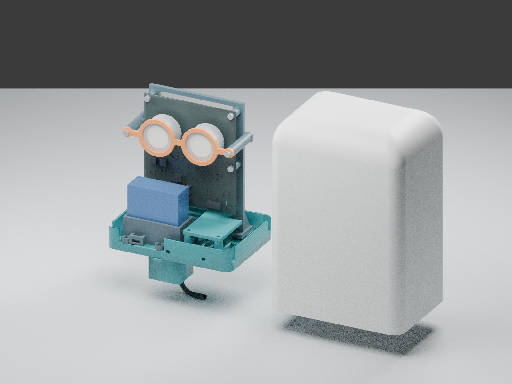

# Skylark bell enclosure — Rev G

Printable hood and removable bottom assembly for the vertical Skylark USB PCB,
two SGX gas cells and a PMS5003. The tray, left-side PMS cradle and single gas
splash cover are separate prints joined with M3 screws. Units are millimetres.



[Closed view](preview/closed.png) · [Rear mounts](preview/rear.png) ·
[Bottom vents](preview/bottom-vents.png) ·
[Tray, cradle and splash cover in print orientation](preview/tray-parts.png)

Renders use the printable solids and simplified electronics envelopes. Cables
and fasteners are illustrative. **Prototype:** inspect a first print with actual
parts. CAD checks do not establish rain resistance, gas response, temperature
accuracy or mechanical strength. This ventilated housing has no assigned IP rating.

## Dimensions and files

- Main body: **130 wide × 94 deep × 185 high**, with a flush rear mounting face.
- Hood: 3.2 mm nominal walls and roof, rounded vertical corners and a **25 mm
  top radius**. The curve occupies Z=135–160; inner radius is 21.8 mm. A flat
  central roof remains.
- The protective skirt extends **25 mm below the tray underside** (Z=0). The
  tray withdraws downward through the open lip at Z=−25.
- Two rear M4 keyholes: **80 mm vertical pitch**, Ø9 mm entries, 4.6 mm necks
  and 10 mm slide. Closed internal pockets separate them from the sensor chamber.
- PCB: 90 × 100 × 1.6 mm, USB edge down. Top-left is (−45,0,135); back is Y=1.6.
  All four actual mounting holes are used and the thermal finger is unsupported.
- Gas cells: Ø31.5 × 15.5 mm with 4.88 mm socket stand-off, measured from the PCB
  seating surface to the upper rim and including the flange. Front faces have
  22.61 mm clearance to the hood. Retainer clearance is 0.31 mm axially, with
  Ø28 mm openings. Confirm the purchased cells' membranes fit these openings.
- PMS5003: 50 × 38 × 21 mm; broad face parallel to the PCB and 50 × 21 mm port
  face downward. Body bounds: X=−45…5, Y=−33…−12, Z=22…60. The cradle's collar
  rises 8 mm above its seat, with 0.4 mm nominal body clearance. A tie retains it.
  The body is 30.25 mm below the gas cells; verify connector and harness bends.
- Bottom locating rim: 0.6 mm clearance per side, relieved around hood bosses
  and cradle tabs. Tray floor is 8 mm thick; rim reaches Z=20.
- Single L-shaped splash cover: 3 mm plate on four Ø8 mm posts, with **18 mm
  clear height** above the tray. Its top is Z=29. The carrier's lower crossbar
  starts at Z=31, permitting vertical assembly over the fitted cover.
- USB clamp halves sit 3 mm below the tray, inside the skirt.

Authored sources: [enclosure.py](enclosure.py), [check.py](check.py),
[test_checks.py](test_checks.py) and [render.py](render.py). STL, STEP, assembly,
validation, renders and GLB are generated locally in `hw/releases/skylark-bell-r7/`.
Release packages remain ignored. Electronics are simplified package envelopes
from the native PCB placement and dimensions.

## Printable parts and orientation

| File | Quantity | Print orientation / purpose |
| --- | --- | --- |
| `hood.stl` | 1 | Roof-down; outer bell and M4 mounts |
| `bottom.stl` | 1 | Flat underside down; slotted tray and locating rim |
| `pms-cradle.stl` | 1 | Flat base down; ducts, low collar and tie eyes |
| `gas-splash-cover.stl` | 1 | Broad top face down; posts grow upward |
| `pcb-carrier.stl` | 1 | Feet down; PCB and retainer supports |
| `cell-retainer.stl` | 1 | Flat face down; cell withdrawal stops |
| `pms-exhaust-extension.stl` | 1 | Flange down; exhaust to skirt edge |
| `cable-left.stl`, `cable-right.stl` | 1 each | Flat; split cable clamp |
| `fit-coupon.stl` | 1 first | Insert bores Ø3.9/4.0/4.1/4.2/4.3, left to right |

STLs are already oriented on the print bed. Use white outdoor-suitable ASA for
housing parts. PETG is suitable for an initial fit print. Start with a 0.4 mm
nozzle, 0.2 mm layers, five perimeters and 30–40% infill; follow the filament
supplier's processing and ventilation guidance. Qualify material and colour for
long-term exposure.

The tray has no integrated elevated splash covers, tall PMS guides or recessed
USB-clamp pocket. Inspect bridging over small screw counterbores. The separate
cover prints on its broad face with no suspended roof. The cradle's tie eyes
have **8 mm bridges and 3 mm roofs**: qualify these short bridges in the slicer
and first print. It has no tall free-standing guide fingers.

The roof-down hood needs build-plate support beneath its curved outer shoulder.
Keep supports out of the keyhole pockets, which have 45° lead-ins and short
bridges. Support closure-boss/rib overhangs as needed. The PCB carrier still
needs supports beneath the raised lower crossbar, retainer arms and standoffs.
Remove support debris from every air path and inspect sliced walls for gaps.

## Hardware

| Quantity | Hardware | Location |
| --- | --- | --- |
| 4 | M3 × 12 button-head screws, head Ø≤6, height ≤2 mm | Tray into hood |
| 4 | M3 heat-set inserts, nominal Ø4.6 × 5 mm | Hood; Ø4.2 pilot |
| 4 | M3 × 16 screws | PCB into carrier |
| 2 | M3 × 8 screws | Carrier feet into tray |
| 2 | M3 × 40 screws | Cell retainer through carrier arms |
| 2 | M3 × 12 screws | Cable clamps from below into tray nuts |
| 2 | M3 × 10 screws | Left cradle tabs from above into tray nuts |
| 2 | M3 × 16 screws | Exhaust flanges from below, through tray, into cradle nuts |
| 4 | M3 × 25 screws | Splash cover from above into tray nuts |
| 18 | M3 hex nuts, 5.5 mm across flats, nominal 2.4 mm thick | Captive pockets |
| 1 | 4.8 mm cable tie, about 200 mm long | PMS retention |
| 2 | M4 pan-head screws, head Ø≤8 × 3.5 mm | Wall/support; length to suit anchor |
| As needed | 1 mm closed-cell gasket strip | PMS inlet/exhaust divider |

Use corrosion-resistant fasteners. New cover/cradle/clamp screw-head envelopes
allow Ø6 × 3 mm heads. Insert dimensions are a fit contract: print the coupon,
measure the actual insert and adjust its bore before making the hood. Nut
pockets are 5.7 mm across flats. Confirm thread engagement and avoid bottoming
out or overtightening plastic, the PCB or cells.

## Assembly

1. Deburr, clear ducts and fit the four hood inserts from its open end. Keep
   insert seating faces flush.
2. Load ten nuts into the tray from above: two carrier-foot nuts, two clamp
   nuts, two left cradle-mount nuts and four cover nuts. Load two more into the
   right cradle tabs and six into the carrier rear (four PCB and two retainer
   nuts). Hold them temporarily with removable tape if needed.
3. Attach the cradle with two M3 × 10 screws through its left tabs from above.
   Hold the exhaust extension below the tray and use two M3 × 16 screws from
   below, through its flanges and tray into the right cradle-tab nuts. Confirm
   the ducts align and contact faces sit flat. Test these printed interfaces
   for leaks; their airtightness has not been established.
4. Fit the single splash cover using four M3 × 25 screws. All posts must sit
   flat on the tray. Keep slots and cover edges free of wiring; do not bow the
   cover by overtightening.
5. Fit the PCB to its carrier with four M3 × 16 screws, keeping the thermal
   finger free and checking backside components and sockets clear the frame.
   Fit the gas cells in the correct pin orientation and attach the ring retainer
   with two M3 × 40 screws. Rings are withdrawal stops and must not press on
   membranes. Lower this assembly over the cover and secure its feet with two
   M3 × 8 screws.
6. Pass the USB plug through the 18 × 10 mm tray aperture and connect it. Its
   reserved envelope is 14 × 9 × 22 mm; check the actual overmould. Attach the
   split clamps below the tray with M3 × 12 screws. The bore is 5 mm: use a
   removable liner for a smaller cable or change the bore for a larger one.
   Clamp the jacket without crushing it and form an external drip loop.
7. Fit gasket strip to the PMS divider, whose top is 0.6 mm below the sensor
   face. A nominal 1 mm strip compresses to that gap. Keep it clear of the ports.
   Lower the PMS into its collar, inlet over the left duct (−X) and exhaust over
   the right (+X). Confirm the actual sensor markings. Exhaust reaches the lip.
8. Feed the tie through both cradle eyes and over the PMS, keeping its connector
   clear. Each eye opens upward beside the body. Connect the mapped JST harness;
   keep it below the gas faces and outside the reserved gas passages.
9. Lower the hood over the assembly without force and fit four underside M3 × 12
   closure screws. For service, disconnect USB, remove these screws and lower
   the complete tray. Use a driver with ≥50 mm exposed shaft, diameter ≤6 mm.
   Remove the carrier before lifting the splash cover off the tray.

## Wall mounting

Install two M4 pan-head screws vertically, **80 mm centre to centre**, into
suitable anchors or a tapped support. Select length and engagement for that
support. Use heads at most Ø8 × 3.5 mm, not countersunk heads. Leave **3.6–3.9 mm
under each head**. Fit the lower Ø9 mm entries over the heads, push the rear
face toward the support and lower the housing **10 mm** into its seats. Adjust
stand-off on the actual print for seating without force or excessive looseness.
Seated shaft positions are X=0, Z=45 and 125; entry centres are Z=35 and 115.

These gravity-seated keyholes have no anti-lift latch. Lift 10 mm for removal.
Confirm seating, pull resistance and lift-off behavior for the installation.
Pockets are closed toward the electronics and drain through their lower entries;
this does not establish an IP rating. Keep at least 200 mm clear below the lip
for servicing. Keep openings above snow and vegetation. Check creep, layer
cracking and movement under representative cable, wind and ice loads.

## Airflow and field checks

The sides and roof remain closed. All ventilation enters from below, sheltered
by the 25 mm skirt. The single splash cover overlaps both dedicated gas vent
banks to interrupt direct upward splash. Slots retain at least 2 mm ribs.

| Gas vent bank | Clear floor aperture | Checked clear exits around cover |
| --- | --- | --- |
| Right of PMS | 752 mm² | At least 1,180 mm² |
| Behind PCB | 630 mm² | At least 799 mm² |
| Total | **1,382 mm²** | **At least 1,979 mm²** |

The floor area is about twice the original 686 mm². Areas exclude PMS ports,
cable openings and incidental gaps. Exit figures count verified clear passages
and omit narrower wall-side gaps. These are geometric areas, not effective flow
areas or measured exchange rates. Keep cover edges, front risers and the rear
passage beside the mounting pockets clear of wiring.

Gas-cell exchange is passive. The separately ducted PMS fan does not ventilate
the gas chamber. Its divider separates inlet and exhaust, and the extension
carries exhaust to the skirt edge. Test duct leakage and PMS performance with
the longer path. No fine filter is fitted; mesh or membranes require response
qualification.

Before deployment, test fastening, cable and cell retention, drainage and driven
rain with an unpowered dummy assembly. Measure temperature offset, PM
recirculation and both gases' step response against an open assembly in still
air and wind from different directions. Record delay, recovery and steady
readings. Larger bottom openings do not establish the upper chamber's response
time. Check whether plastics, gasket material or coating affect gas baselines.
Follow coating exclusions in the [Skylark guide](../../README.md). Inspect for
insects, ash, moisture and blocked openings.

## Regenerating and checking

Use a separate environment with CadQuery 2.6.1, trimesh 4.8.3 and SciPy. Blender
4.0.2 produces the previews. Do not add these dependencies to atopile.

```sh
python hw/skylark-usb/mechanical/bell/enclosure.py
python hw/skylark-usb/mechanical/bell/check.py
python hw/skylark-usb/mechanical/bell/test_checks.py
blender --background --python hw/skylark-usb/mechanical/bell/render.py
python environment/check_project.py
```

The root README uses a separate studio view with the populated PCB asset. After
exporting the enclosure and regenerating the [PCB display model](../../../../sw/ui/assets/README.md), run:

```sh
blender --background --python-exit-code 1 --python hw/skylark-usb/mechanical/bell/render_readme.py
```

This writes `docs/images/skylark-assembly.png` and its adjacent provenance JSON.
It verifies source hashes and uses the same tray/carrier placement as the
mechanical model. Its component bodies are authored dimension envelopes;
fasteners and cable dressing are illustrative. The existing mechanical previews
above retain their simplified electronics. Source CAD is read-only.

Checks cover valid solids and closed meshes, part/electronics intersections,
PCB mounting points, gas/PMS air passages, covered floor slots, baffle exits,
chamber passages, keyhole entry/retention/shielding, driver access, sampled tray
removal, new screw/head envelopes, tie tunnels and upward turns, and carrier
assembly over the cover. Independent fault fixtures reject obstructions,
missing covers and missing mounting features. Provenance binds exports to PCB
and placement hashes. The electrical CAD is read-only; these checks do not
establish physical qualification.

## References and attribution

The service arrangement is inspired by
[AirGradient's Open Air assembly guide](https://www.airgradient.com/documentation/kb/kb-old-instructions-the-airgradient-open-air-outdoor-air-quality-monitor-presoldered-version-pcb-version-1-1).
Skylark's CAD uses its own dimensions; no AirGradient mesh is included. Authored
source retains the repository GPL-3.0 license.

The [Plantower PMS5003 manual, v2.3](https://evelta.com/content/datasheets/203-PMS5003.pdf)
provides body/port dimensions (page 12) and inlet/exhaust separation guidance
(page 10). SGX dimensions and socket choices are linked in the Skylark guide.
Confirm all dimensions against purchased parts.

[Example M4 pan-head dimensions](https://www.vital-parts.co.uk/phillips-pan-head-machine-screws-din-7985h/17074-pph7985h-m4-8-a4)
show Ø8 × 3.25 mm heads. This is a geometry reference, not an anchor or screw-
length prescription.
